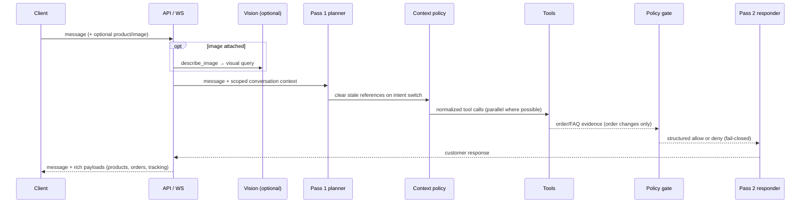

# Backend

The FastAPI backend owns product/FAQ retrieval, order operations, WebSocket chat, session authorization, and observability. It is organized as `api/` (routes + agent), `services/` (tools, context, cache, auth, LLM providers), and `db/` (schema, migrations, loader).

## Agent flow



Deeper reference: [architecture](../docs/ARCHITECTURE.md) ·
[diagrams](../docs/DIAGRAMS.md) · [API reference](../docs/API_REFERENCE.md) ·
[RAG pipeline](../docs/RAG.md).

## Run locally

```bash
uv sync
cp ../.env.example ../.env
uv run alembic upgrade head
uv run python backend/db/data_loader.py
uv run uvicorn backend.main:app --reload
```

`LLM_PROVIDER` selects `openai`, `anthropic`, or `gemini`. Chat providers are interchangeable behind `backend/services/llm`; embeddings remain OpenAI `text-embedding-3-small` because the existing pgvector column is 1536-dimensional.

Catalog files can be loaded from another directory with `DATA_DIR=/path/to/catalog uv run python backend/db/data_loader.py` or `--data-dir /path/to/catalog`. Read [the full data-loader contract](../docs/DATA_LOADER.md) before importing client data.

## Observability

Set `OTEL_EXPORTER_OTLP_ENDPOINT` (and `OTEL_EXPORTER_OTLP_PROTOCOL=http`) so the app exports OpenTelemetry traces, metrics, and logs to OpenObserve — a single lightweight, OTLP-native backend. Langfuse credentials enable LLM traces, prompt versions, token/cost data, and evaluation scores. Both run behind the `obs` profile in the root `docker-compose.yml` (`docker compose --profile obs up`). See [the observability guide](../docs/OBSERVABILITY.md).
