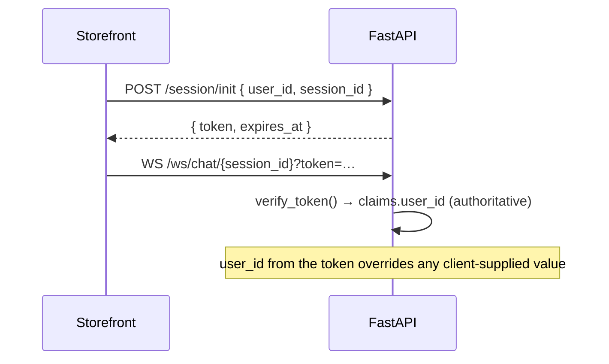
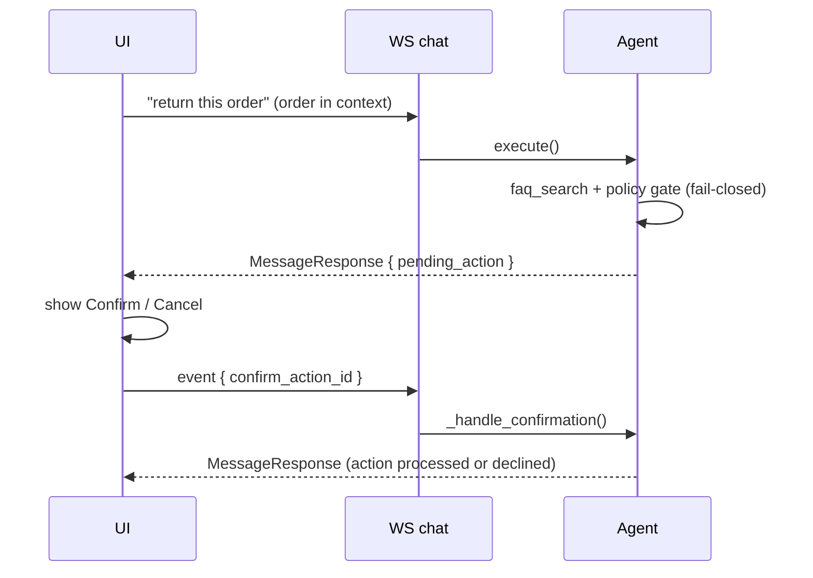

# API Reference

The backend exposes a small REST surface for the storefront and a single
authenticated **WebSocket** for chat. User-scoped routes require a signed session
token (see [Authentication](#authentication)). Interactive OpenAPI docs are
served at `/docs` when the backend is running.

- Base URL (dev): `http://localhost:8000`
- Content type: `application/json`
- Auth: `Authorization: Bearer <session_token>` header, or `?token=` query param
  on the WebSocket.

## Authentication

Sessions are stateless, HMAC-signed tokens bound to a `user_id` + `session_id`
with an expiry ([`services/auth.py`](../backend/services/auth.py)). A client
calls `POST /session/init` once, then sends the returned token on the WebSocket
and on user-scoped REST calls. The server verifies the signature and scopes
those operations to the token's `user_id`, so a client cannot act as another
user. Rotate `AUTH_SECRET` to invalidate all outstanding tokens.

> **Enforcement is opt-in and currently OFF.** Tokens are only *required* when
> `AUTH_ENFORCED=true` **and** `AUTH_SECRET` is set. The bundled storefront does
> not yet call `/session/init`, so enabling enforcement rejects every WebSocket
> with close code `4401` and the chat stops working. The ✓ in the table below
> marks routes that *scope to* a token's `user_id` when one is supplied — not
> routes that reject anonymous callers today.
>
> Because of that, the demo's protection is deployment-level (reverse proxy /
> private network), not application-level. Do not expose it to the open internet
> and assume the API is access-controlled.



## REST endpoints

| Method | Path | Auth | Purpose |
| --- | --- | :---: | --- |
| `GET` | `/health` | – | Liveness probe |
| `GET` | `/` | – | Service root |
| `POST` | `/session/init` | – | Issue a signed session token |
| `GET` | `/products` | – | List catalog for a store (`?store=`, `?limit=`) |
| `GET` | `/products/{product_id}` | – | Product detail |
| `POST` | `/orders` | ✓ | Create demo order(s) for the authenticated user |
| `GET` | `/chat/history/{session_id}` | – | Replay stored chat messages |
| `GET` | `/chat/typing/{session_id}` | – | Poll assistant typing state |
| `POST` | `/chat/message/{session_id}` | – | Post a message via REST (WS alternative) |
| `POST` | `/session/{session_id}/end` | – | Delete a visitor's session data (see [Data retention](#data-retention)) |
| `GET` | `/flagged-sessions` | ✓ | List sessions flagged for human review (`?store=`) |
| `POST` | `/flagged-sessions/{flagged_id}/review` | ✓ | Mark a flagged session reviewed |
| `WS` | `/ws/chat/{session_id}` | ✓ | Real-time chat (see protocol below) |

### `POST /session/init`

```jsonc
// Request
{ "user_id": "uuid", "session_id": "string" }
// Response
{ "token": "base64url.body.signature", "expires_at": "ISO-8601" }
```

Returns `503` if `AUTH_SECRET` is not configured (tokens can't be signed).

### `GET /products?store=aurora_style&limit=30`

Returns an array of products (id, name, description, price, currency, `inStock`,
`image`, `images[]`, `variants[]`, `sizes[]`, `colors[]`).

### `POST /orders`  *(auth)*

Creates demo order(s) for the token's `user_id`. Response: `{ "orders": [OrderStatus, …] }`.

### `POST /session/{session_id}/end?user_id=<uuid>`

Deletes everything belonging to one visitor: the Redis transcript, typing state
and moderation lock for `session_id`, the structured conversation context, and —
when `user_id` is supplied — that user's demo orders. Other users' data is never
touched.

```jsonc
// Response
{ "status": "ok", "session": true, "context": true, "orders": 2 }
```

A `POST` rather than a `DELETE` because the browser fires it with
`navigator.sendBeacon` on `pagehide`, and beacons are always POST. Idempotent
and best-effort: repeat calls, a missing session, and a malformed `user_id` all
return `200` (`"status": "partial"` if some step failed), because the tab is
already gone by the time it runs and the sweep below is the backstop.

## Data retention

The storefront tells visitors their data is deleted when they close the tab, so
the deletion path is part of the contract:

| Data | Where | Deleted |
| --- | --- | --- |
| Chat transcript | Redis `session_history:` | On tab close, else 24h TTL |
| Conversation context | Redis `context:` / `turn:` | On tab close, else 24h TTL |
| Moderation lock | Redis `session_lock:` | On tab close, else 24h TTL |
| Typing state | Redis `session_state:` | 5 min TTL |
| Pending confirmation | Redis `pending_action:` | 5 min TTL |
| Demo orders (+ location) | Postgres `orders` | On tab close, else the sweep below |
| Name, geo, cart | Browser `sessionStorage` | On tab close (browser-managed) |

Tab close is the primary path (`POST /session/{id}/end` above). A beacon can be
dropped — crash, force-quit, offline — so `clear_expired_orders`
([`backend/main.py`](../backend/main.py)) sweeps orders older than
`DEMO_ORDER_TTL_MINUTES` (default 1440 = 24h, interval 3600s).

**That sweep's `DELETE` is not scoped by user**, so the TTL must stay well above
any realistic session length. It was previously 10 minutes, which destroyed
active visitors' orders mid-session — "track my order" would report no orders at
all. Set `DEMO_ORDER_TTL_MINUTES<=0` to disable it.

`GET /chat/history/{session_id}` returns `session_exists: false` once the server
has no record of a session. The frontend uses this to reset a stale tab (a
`sessionStorage` transcript can outlive the Redis keys) instead of showing a
conversation the backend has forgotten.

## WebSocket chat protocol

Connect to `ws/chat/{session_id}?token=<session_token>`. The client sends
`EventSchema` JSON frames; the server replies with `MessageResponse` frames.

### Client → server (`EventSchema`)

```jsonc
{
  "event_id": "uuid",
  "event_data": {
    "question": "I'm looking for a summer dress",
    "store": "aurora_style",
    "user_name": "Sam",
    "user_id": "uuid",                 // overridden by the token's user_id
    "product": {                        // optional: selected product context
      "id": "uuid", "name": "…", "price": 0, "currency": "USD"
    },
    "order": { /* OrderStatus */ },     // optional: selected order context
    "image": "data:image/jpeg;base64,…",// optional: image search
    "is_initial_message": false,        // optional: seed greeting, no agent run
    "confirm_action_id": null           // optional: confirm a pending action
  }
}
```

Key fields:

- **`product`** — attaches a selected catalog item as context. Enables
  "similar to this" and styling questions.
- **`image`** — a data/URL image; triggers vision→text→search
  ("find outfits similar to this picture").
- **`confirm_action_id`** — echoes a `pending_action.action_id` from a prior
  response to confirm (or decline) an order change.
- **`is_initial_message`** — stores a seed assistant greeting without invoking
  the agent.

### Server → client (`MessageResponse`)

```jsonc
{
  "content": "I found a few options you might like…",
  "store": "aurora_style",
  "suggestions": ["What sizes are available?", "Show similar products"],
  "products": [ /* Product[] — rendered as cards by the UI */ ],
  "orders":   [ /* OrderStatus[] */ ],
  "tracking_data": { /* OrderLocation */ },
  "pending_action": {                    // present when confirmation is required
    "action_id": "uuid",
    "action_type": "process_order",
    "parameters": { "order_id": "…", "action": "return" },
    "requires_confirmation": true,
    "confirmation_message": "Are you sure you want to return this order?"
  },
  "requires_human": false,
  "confidence_score": 0.95,
  "session_locked": false,
  "lock_reason": null,
  "warning_message": null,
  "flagging_reason": "none",
  "tools_used": ["product_search"],
  "timestamp": "ISO-8601"
}
```

The UI renders product/order/tracking payloads as rich components — product
details, prices, images, and order IDs are intentionally **not** placed in
`content` (see the Pass 2 prompt rules).

### Confirmation round-trip

Order-changing actions never execute on the first turn. The agent returns a
`pending_action`; the client confirms by sending a new event with
`confirm_action_id`.



## Error handling

- `503` — auth not configured (`/session/init`).
- `401 / 4401` — missing, invalid, or expired token on user-scoped routes / WS.
- Locked sessions receive a normal `MessageResponse` with `session_locked: true`
  and `lock_reason` (repeated policy violations pause new messages).
- Tool failures degrade gracefully: the agent returns a helpful fallback rather
  than surfacing a stack trace.
