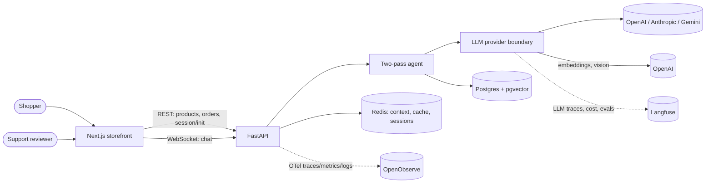
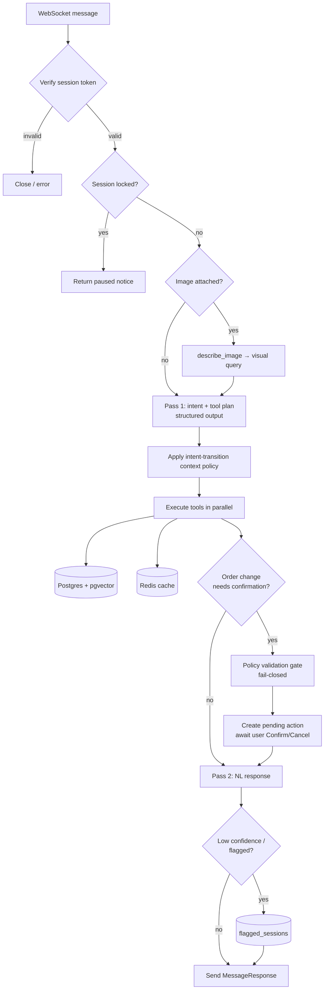
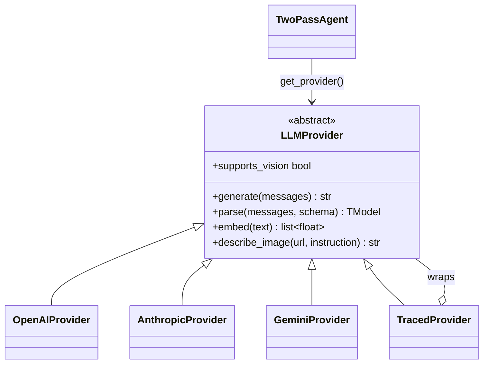

# Architecture

A Next.js storefront talks to a FastAPI backend over REST (catalog, orders) and
an authenticated WebSocket (chat). The chat request is handled by a **two-pass
agent**: Pass 1 plans intent and tools with structured output, tools run in
parallel against Postgres/pgvector and Redis, an optional policy gate validates
order-changing actions, and Pass 2 writes the natural-language reply. One
LLM-provider boundary keeps the agent independent of any vendor SDK.

> Companion docs: [API reference](API_REFERENCE.md) ·
> [diagrams](DIAGRAMS.md) (ERD, sequences, state) · [RAG pipeline](RAG.md) ·
> [observability](OBSERVABILITY.md) · [data loader](DATA_LOADER.md).

## System context

## Chat request flow

Every chat turn runs the same pipeline. The turn is wrapped in one named
Langfuse trace (`chat_turn`) so Pass 1, Pass 2, policy, and embedding calls nest
under a single, session-tagged trace.

See [DIAGRAMS.md](DIAGRAMS.md) for the message-level sequence diagrams
(standard turn, order modification with confirmation, image similarity).

## The two-pass agent

`TwoPassAgent.execute()` is the single entry point; it wraps `_execute_turn()`
in the Langfuse trace and runs the pipeline above.

| Stage | Prompt / mechanism | Output |
| --- | --- | --- |
| **Pass 1 — plan** | `pass1_intent_prompt.txt` via `provider.parse(..., Pass1Output)` | Typed `Pass1Output`: intent, tool calls, context understanding, self-assessment |
| **Context policy** | `api/context_policy.py` | Clears stale product/order references on intent switches |
| **Tools** | `services/tool.py`, `asyncio.gather` | Product / FAQ / variant / order / tracking results |
| **Policy gate** | `policy_validation_prompt.txt` via `provider.parse(..., PolicyValidationResult)` | Allow/deny for cancel/return, **fail-closed** |
| **Pass 2 — respond** | `pass2_response_prompt.txt` via `provider.generate(...)` | Natural-language reply |

Structured output (not native function-calling) is used for planning: the model
returns a Pydantic-validated `Pass1Output` and the agent executes the tools
itself. Server-owned parameters (`store`, `user_id`) are injected by the backend,
so the model never has to echo them.

## LLM provider boundary

One chat provider is active per deployment (`LLM_PROVIDER`). The boundary
normalizes chat, structured output, embeddings, and vision so agent code never
imports a vendor SDK.

- **Embeddings stay on OpenAI** (`text-embedding-3-small`, 1536-dim) regardless
  of the chat provider — the pgvector column is dimension-locked, so Anthropic
  and Gemini providers delegate embedding to a nested OpenAI client.
- **`TracedProvider`** decorates the active provider and records every call to
  Langfuse as a generation, nested under the per-turn trace. No Langfuse keys →
  no wrapper, no overhead.
- **Vision** (`describe_image`) powers image-based search; providers without it
  report `supports_vision = False` and callers fall back to text.

## Conversation context

The agent keeps one typed conversation-context object in Redis (per session).
Product, order, and pending-confirmation data is retained only while the current
intent permits it; switching topics clears stale references **before** planning,
which is what prevents cross-question context bleed. See the context state
machine in [DIAGRAMS.md](DIAGRAMS.md#conversation-context-state).

## Retrieval (RAG)

Product and FAQ search is **hybrid**: pgvector cosine similarity fused with a
Postgres trigram/keyword pass via reciprocal-rank fusion. Products are embedded
as a composite document (name + category + tags + description). Image search
turns a picture into a text description and runs the same pipeline. Full detail
in [RAG.md](RAG.md).

## Data & infrastructure

| Concern | Technology | Notes |
| --- | --- | --- |
| Catalog, orders, vectors | Postgres + pgvector | HNSW cosine indexes on embeddings; trigram GIN on product name/category |
| Context, cache, sessions | Redis | Typed context, query/embedding cache, pending confirmations, typing state |
| Sessions | HMAC-signed tokens | Stateless; bound to `user_id` + `session_id`; rotate `AUTH_SECRET` to revoke |
| App telemetry | OpenObserve (OTel) | Single Go binary; traces, metrics, logs |
| LLM telemetry | Langfuse | Traces, token/cost, prompt versions, evals |

See the [entity-relationship diagram](DIAGRAMS.md#data-model-erd) for the full
data model.
