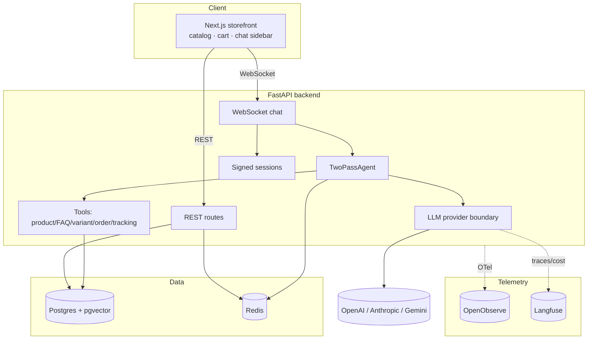
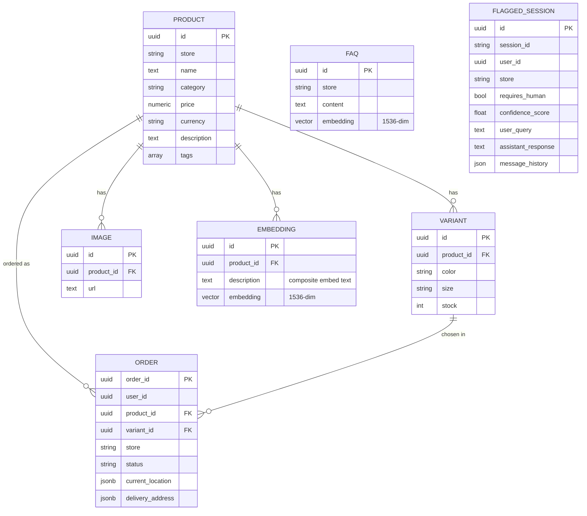
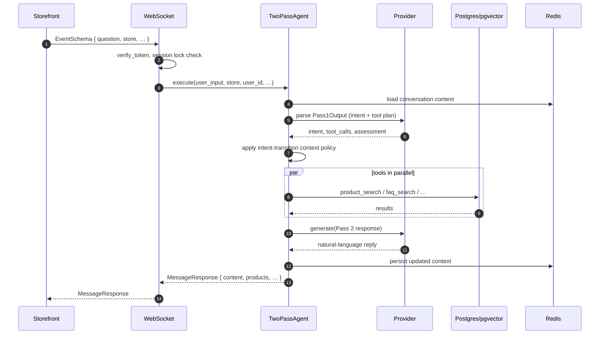
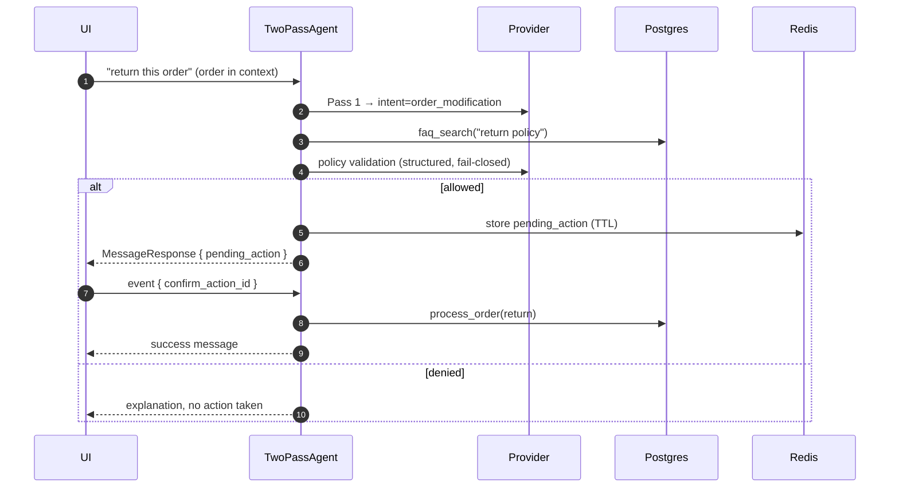
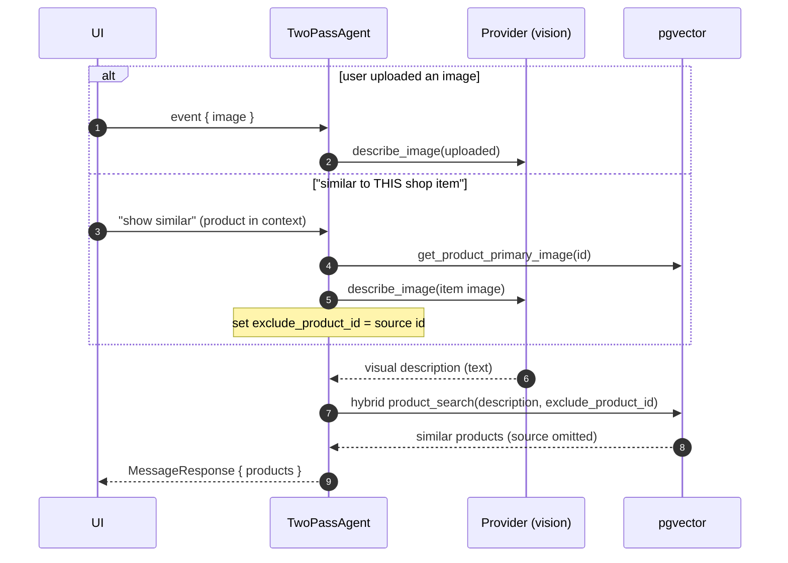
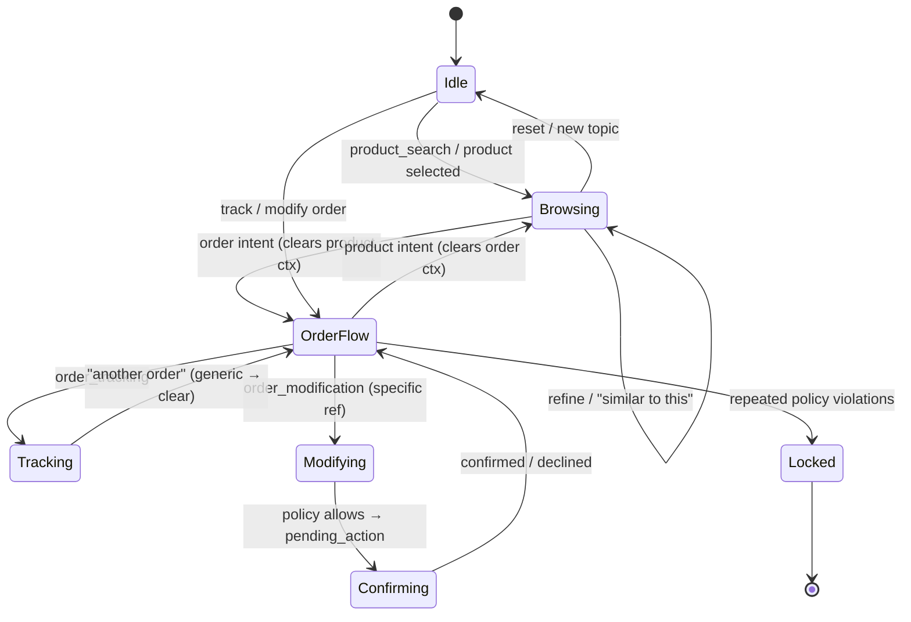
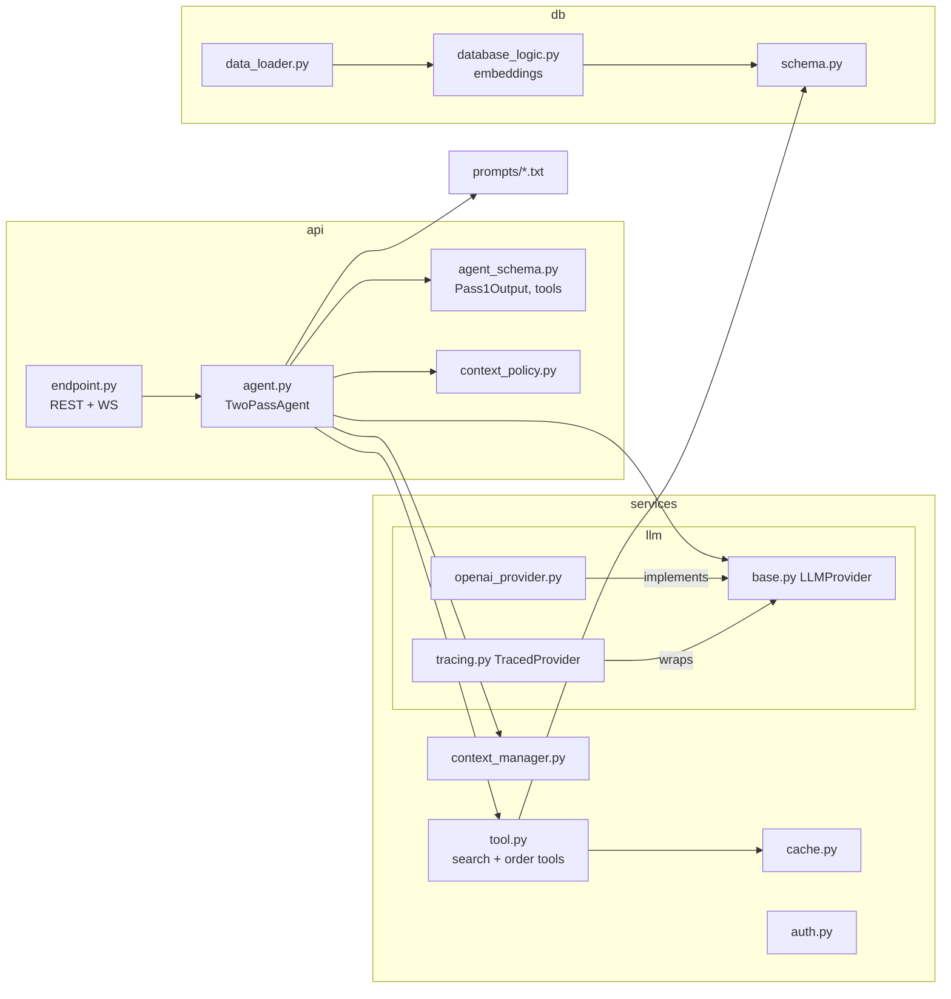

# Diagrams

Visual reference for the system: data model, runtime sequences, and the
conversation-context state machine. All diagrams are Mermaid and render inline
on GitHub. See also [ARCHITECTURE.md](ARCHITECTURE.md) and [RAG.md](RAG.md).

- [Container view](#container-view)
- [Data model (ERD)](#data-model-erd)
- [Sequence — standard chat turn](#sequence--standard-chat-turn)
- [Sequence — order modification with confirmation](#sequence--order-modification-with-confirmation)
- [Sequence — image and similar-item search](#sequence--image-and-similar-item-search)
- [Conversation-context state](#conversation-context-state)
- [Module map](#module-map)

## Container view

## Data model (ERD)

Postgres schema ([`db/schema.py`](../backend/db/schema.py)). Vectors are
`pgvector` columns; product embeddings use an HNSW cosine index and product
name/category have trigram GIN indexes for the hybrid keyword pass.

`FAQ` and `FLAGGED_SESSION` are intentionally standalone (no FKs): FAQs are
store-scoped text, and a flagged session is an audit snapshot of one turn.

## Sequence — standard chat turn

## Sequence — order modification with confirmation

Order changes are **two-step and fail-closed**: the policy gate must allow the
action, and the user must confirm before anything is processed.

## Sequence — image and similar-item search

Both entry points converge on the same vision→text→hybrid-search path. For a
selected shop item, the item's own catalog image is used and the source product
is excluded from its own results.

## Conversation-context state

The agent retains product/order/pending references only while the intent
permits. `context_policy.apply_intent_transitions` clears stale references
**before** planning the next turn, preventing cross-question bleed. Specific
references ("this", "it") keep context; generic ones ("an order", "another")
clear it.

## Module map

