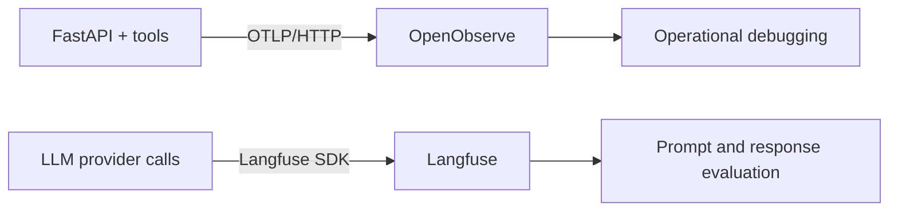

# Observability

A complementary two-tool setup — a lightweight OTel backend for the app, and an
LLM-native tool for the agent — instead of a build-your-own Grafana/Prometheus/
Loki/Tempo stack.

| System | Captures | Purpose |
| --- | --- | --- |
| OpenObserve | OpenTelemetry traces, metrics, logs | API, database, Redis, and infrastructure operations |
| Langfuse | LLM traces, prompt versions, token/cost data, eval scores | Agent quality and provider behaviour |

**Why OpenObserve:** it's a single Go binary (~512 MB RAM, no external database)
with a built-in UI and native OTLP ingest — a ready-made, low-footprint backend
that suits a small VPS far better than the multi-container, ClickHouse-backed
alternatives. The app is instrumented with vendor-neutral OpenTelemetry, so you
can repoint `OTEL_EXPORTER_OTLP_ENDPOINT` at any OTLP backend (a cloud APM, etc.)
without code changes.



## Running it

Everything is in one `docker-compose.yml`; observability is opt-in behind the
`obs` profile so the normal dev loop stays light:

```bash
docker compose up                 # app only (db, redis, fastapi)
docker compose --profile obs up   # app + OpenObserve + Langfuse
# or via the helper:
./scripts/dev.sh obs
```

- **OpenObserve** → http://localhost:5080 (login `admin@example.com` /
  `Complexpass#123`). Traces land automatically — the app exports OTLP over HTTP
  with the Basic-auth header wired in `docker-compose.yml`.
- **Langfuse** → http://localhost:3030 — on first run, create a project and copy
  its `pk-lf-…` / `sk-lf-…` keys into `.env` (`LANGFUSE_PUBLIC_KEY` /
  `LANGFUSE_SECRET_KEY`), then restart the `fastapi` container.

Both no-op cleanly if their endpoints/keys are unset, so the app runs with or
without observability.

## Resource footprint

OpenObserve is a single container (~512 MB RAM, local-disk storage) — light
enough to run on a small VPS. Langfuse is heavier (it brings its own Postgres,
ClickHouse, MinIO, and Redis). On a small Hetzner box, a practical split is:

- run **OpenObserve** anywhere (cheap); and
- run **Langfuse** only in development, on a separate box, or use Langfuse Cloud.

The app itself is lightweight and runs comfortably without either — tracing is
additive, never required.
