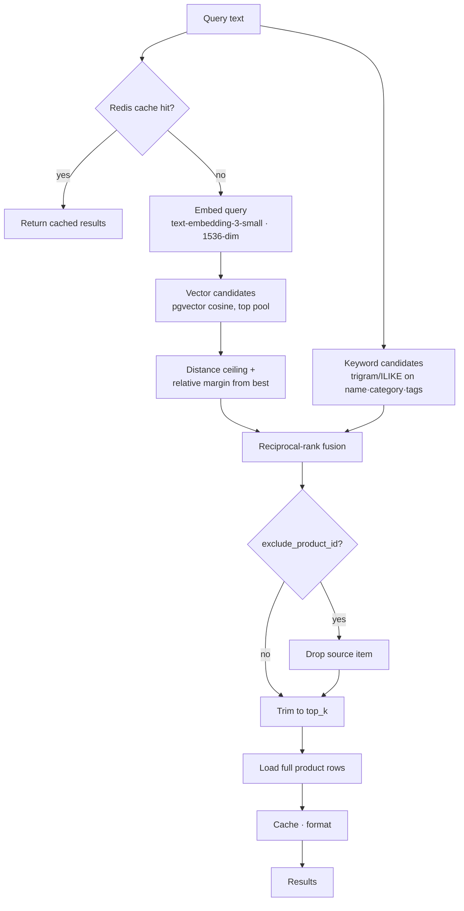

# Retrieval (RAG)

Product and FAQ search is **hybrid**: semantic vector similarity fused with a
lexical keyword pass, so the assistant finds items by meaning *and* by exact
terms. Image queries reuse the same pipeline via a vision→text step.

Core code: [`services/tool.py`](../backend/services/tool.py) (`product_search`),
[`db/services/database_logic.py`](../backend/db/services/database_logic.py)
(`build_embedding_text`), [`services/embedding.py`](../backend/services/embedding.py).

## Pipeline



## What gets embedded

Products are embedded as a **composite document**, not just the description —
name and category carry strong signal that a sparse description misses:

```
"{name}. Category: {category}. Tags: {t1, t2, …}. {description}"
```

Built by `build_embedding_text()` so ingestion and any re-embed produce
byte-identical text. Products are embedded even when the description is empty, so
every item is retrievable. FAQs embed their full text.

Embeddings always use OpenAI `text-embedding-3-small` (1536-dim) regardless of
the chat provider — the pgvector column is dimension-locked, so swapping it would
require a migration and re-index.

## Hybrid search + fusion

1. **Vector pass** — pgvector cosine distance against product embeddings, scoped
   by store, ordered nearest-first over a candidate pool (`max(top_k*4, 20)`).
2. **Distance filtering** — an absolute ceiling plus a *relative* margin from the
   best hit, so a strong match doesn't drag in unrelated tail items, and valid
   but distant matches aren't silently dropped (this replaced a brittle hard
   cutoff that returned nothing for perfectly good queries).
3. **Keyword pass** — Postgres trigram/`ILIKE` over name & category plus exact
   tag match, so lexical terms like "dress" always surface even when the
   embedding is distant.
4. **Reciprocal-rank fusion (RRF)** — the two rankings are merged by
   `Σ 1/(k + rank)`; items appearing in both rise to the top. The fused list is
   trimmed to `top_k` (caller-tunable, so the model can widen recall).

### Tuning knobs

| Constant | Role |
| --- | --- |
| `_MAX_VECTOR_DISTANCE` | Absolute cosine-distance ceiling |
| `_RELATIVE_DISTANCE_MARGIN` | Window from the best hit to keep |
| `_RRF_K` | RRF flattening constant |
| `top_k` (param) | Final result count, 1–25 |

## Image and "similar item" search

Both share one path: **image → text description → hybrid search.**

- **User-uploaded image** — `describe_image` turns the picture into a rich
  garment description (type, colour, pattern, material, style, occasion), which
  becomes the search query.
- **"Similar to THIS shop item"** — the selected product's own catalog image is
  described the same way, and the source product is excluded via
  `exclude_product_id` so "similar" never returns the item itself.

Vision runs on the chat model when it supports it (`supports_vision`); a single
low-detail image is a few hundred tokens (~$0.0002). Providers without vision
fall back to a name/text-based query. See the
[image sequence diagram](DIAGRAMS.md#sequence--image-and-similar-item-search).

## Caching

Plain queries cache their results in Redis (`store`+`top_k`+normalized-query key,
short TTL); query normalization (lowercase, whitespace, trailing punctuation)
improves hit rate. Searches that exclude a source item skip the shared cache —
they're personalized and rarer.

## Extending

New stores need no code: drop `<store>_products.json` and `<store>_faq.json` in
the data directory and run the loader; embeddings are generated on ingest. See
the [data-loader guide](DATA_LOADER.md). Re-embed after changing the composite
format with `data_loader.py --reset`.
